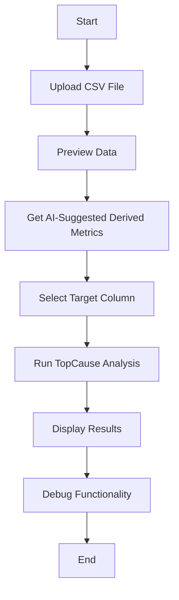

# TopCause Analysis Application

## Overview

The TopCause Analysis Application is a web-based tool designed to help users analyze datasets by identifying the most significant factors affecting a target variable. The application allows users to upload CSV files, preview the data, and receive AI-suggested derived metrics for deeper insights.

## Features

1. **CSV File Upload**: Users can upload CSV files containing their datasets for analysis.
2. **Data Preview**: After uploading, users can preview the data in a table format to ensure it has been loaded correctly.
3. **AI-Suggested Derived Metrics**: The application can suggest derived metrics based on the uploaded dataset, helping users identify additional features that may improve their analysis.
4. **Target Column Selection**: Users can select a target column for analysis, which is the variable they want to understand better.
5. **TopCause Analysis**: The application runs the TopCause algorithm to identify the most significant actions that can improve the target variable.
6. **Results Display**: The results of the analysis are displayed in a user-friendly format, allowing users to easily interpret the findings.
7. **Debug Functionality**: A debug panel is available for manual input of results, which can be useful for testing and validation.

## Workflow Diagram



## Getting Started

To get started with the TopCause Analysis Application:

1. Clone the repository:
   ```bash
   git clone <repository-url>
   cd <repository-directory>
   ```

2. Open `index.html` in a web browser.

3. Follow the on-screen instructions to upload your CSV file and perform the analysis.

## Requirements

- A modern web browser (Chrome, Firefox, etc.)
- Internet connection for loading external libraries and APIs.

## License

This project is licensed under the MIT License. See the LICENSE file for details.

## Acknowledgments

- This application utilizes the TopCause algorithm for analysis.
